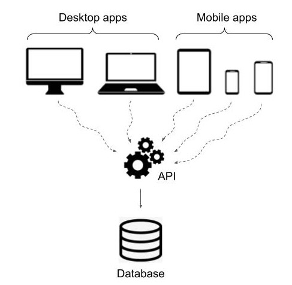
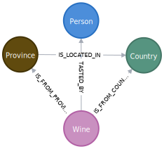

## Build a RESTful API on top of a Neo4j graph

This is the second part of a series on Neo4j for Pythonistas, in which we will go through and end-to-end engineering workflow to build and analyze graph data in Neo4j using Python. [Part 1 of this series](https://thedataquarry.com/posts/neo4j-python-1/) covered what the data was, how it was ingested into a Neo4j graph and how it was validated in Pydantic prior to building the graph in Neo4j. If all of that is familiar to you, read on!

### Why build a REST API?

This might come across as a strong opinion, but I believe that you, as the data engineer who has gained deep familiarity with the data at hand, have the moral responsibility to ensure that it's made available to end users in the most convenient way possible. In most cases, the end user or "consumer" of the data would be a front-end or full stack developer responsible for building a client-facing application for a business case. An API layer that sits between the database (server) and the front end (client) application is ideally suited for this purpose -- it allows a database/backend engineer to ensure that the data being stored is being queried, and most importantly, _served_ to the client as necessary to deliver the most value to the business unit that builds the application.



#### RESTful API architectural constraints

A web service that uses a RESTful API relies on a client-server architecture, where the data access, workload and CPU-intensive processing, and security are in the domain of the _server_, whereas the _client_ simply fetches the data (as valid JSON) and renders it on the front end. The architectural constraints for a RESTful API were first stated by Roy Fielding in his 2000 doctoral thesis, some of which are summarized below.

- __Uniform interface__: The resources inside the system should be exposed to API consumers using a uniform and consistent interface, i.e., through the use of "endpoints", such as `GET`, `POST`, `PUT` and `DELETE`.
- __Client-server architecture__: The data access, workload, CPU-intensive processing and security are the server's responsibility, whereas the client simply fetches the data (as valid JSON) and renders it on the front end.
- __Stateless__: All client-server interactions are stateless. The client is solely responsible for managing the state of the application, and no context is stored on the server between requests.
- __Cacheable__: Client-server interactions can (and should) be cached to improve scalability and performance
- __Layering__: The data and the API can be deployed on completely different servers, and the client will not be able to tell whether it is connected directly to the end server or multiple other servers along the way.

The output of each REST endpoint is valid JSON, which can then be consumed by the client to render on the front end as desired. With that bit of background out of the way, let's look at how to build a REST API on top of the Neo4j database using FastAPI!

## A quick recap on the data

As described in [part 1 of this series](https://thedataquarry.com/posts/neo4j-python-1/), we're working with a dataset of 130k wine reviews ingested as a graph into Neo4j. A sample wine review is shown below.

```json
{
    "points": "90",
    "title": "Castello San Donato in Perano 2009 Riserva  (Chianti Classico)",
    "description": "Made from a blend of 85% Sangiovese and 15% Merlot, this ripe wine delivers soft plum, black currants, clove and cracked pepper sensations accented with coffee and espresso notes. A backbone of firm tannins give structure. Drink now through 2019.",
    "taster_name": "Kerin O'Keefe",
    "taster_twitter_handle": "@kerinokeefe",
    "price": 30,
    "designation": "Riserva",
    "variety": "Red Blend",
    "region_1": "Chianti Classico",
    "region_2": null,
    "province": "Tuscany",
    "country": "Italy",
    "winery": "Castello San Donato in Perano",
    "id": 40825
}
```

The graph data model used is a simple one, for the purposes of this blog post.



A `:Wine` is from a province and a country, with the province itself belonging to a country. In addition, a `:Person` (who is a wine reviewer) tastes each wine and rates it for the review.

## Building the REST API

Once the data is ingested into Neo4j (see [part 1](https://thedataquarry.com/posts/neo4j-python-1/) regarding sync and async methods to ingest data via Python), we can proceed to build an API layer on top of the database. As is most common these days, [FastAPI](https://fastapi.tiangolo.com) is the framework used to build performance, async-friendly APIs in Python. Note that all code in the following sections is available in [this GitHub repo](https://github.com/prrao87/neo4j-python-fastapi).

### Test a dummy endpoint

Install FastAPI using `pip install fastapi` in a virtual environment. A dummy endpoint can be tested to check that the install worked as intended, by saving the snippet below in a file called `main.py` and running it.

```py
from fastapi import FastAPI

app = FastAPI()

@app.get("/")
def root():
    return {"Hello world"}
```

Opening `http://localhost:8000` should display the "Hello world" message on the browser. We're all set to build out our Neo4j database connection!

### Create an async lifespan

FastAPI `0.95.0` introduced a clean interface to set up async interfaces to databases. This is done by using the `asynccontextmanager` decorator available as part of the `contextlib` standard library in Python.

```py
from contextlib import asynccontextmanager

@asynccontextmanager
async def lifespan(app: FastAPI) -> AsyncGenerator[None, None]:
    """Async context manager for Neo4j connection."""
    URI = "bolt://neo4j:7687"
    AUTH = ("neo4j", "password")
    async with AsyncGraphDatabase.driver(URI, auth=AUTH) as driver:
        async with driver.session(database="neo4j") as session:
            app.session = session
            print("Successfully connected to wine reviews Neo4j DB")
            yield
            print("Successfully closed wine reviews Neo4j connection")


app = FastAPI(lifespan=lifespan)

# Define routes below
# ...
```

Note that the URI for the Neo4j browser isn't `localhost` as is normally the case we specify `bolt://neo4j:7687` in this case. This basically says "Connect to the `neo4j` container using the Bolt protocol via port 7687". This is because, as per [part 1](https://thedataquarry.com/posts/neo4j-python-1/) of this series, we initiated the database via Docker. The [`docker-compose.yml`](https://github.com/prrao87/neo4j-python-fastapi/blob/main/docker-compose.yml) file shows how we composed two separate services: one for the Neo4j database, and another for the FastAPI server, both running in their own containers within a shared network `wine`. The container running the FastAPI service is named `neo4j`, which is why the URI is specified the way it is.

💡 __NOTE:__
> In earlier versions of FastAPI (pre `0.95.0`), it was common to define an event-based logic for managing database connections, using the `@app.on_event("startup")` and `@app.on_event("shutdown")` decorators [as described in the docs](https://fastapi.tiangolo.com/advanced/events/#startup-event). However, this has since been deprecated, and the `lifespan` object is the recommended method to manage DB connections in FastAPI, especially for asynchronous connections.

### Create routers

[As mentioned in the FastAPI docs](https://fastapi.tiangolo.com/tutorial/bigger-applications/), there are multiple ways to structure your application directories. There's no one "right" way to structure a large application with multiple end points, but, after some experimenting, I've narrowed down on the structure below that works well for a variety of use cases.

```sh
└── src
    └── api
        ├── routers
        |    └── rest.py
        ├── schemas
        |    └── wine.py
        ├── __init__.py
        └── main.py
```

In FastAPI terminology, a "route" is a pathway to a set of endpoints that answer specific kinds of queries -- these are grouped together and stored under the `routers` directory. FastAPI relies on Pydantic for model validation, so, just like in the case with data ingestion, we specify a REST schema in the `schemas` directory.

The `rest..py` router file contains the following:

```py

```
