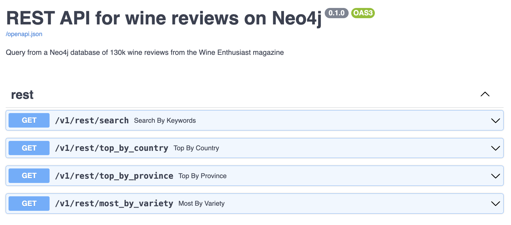

## Build a RESTful API on top of a Neo4j graph

This is the second part of a series on Neo4j for Pythonistas, in which we will go through and end-to-end engineering workflow to build and analyze graph data in Neo4j using Python. [Part 1 of this series](https://thedataquarry.com/posts/neo4j-python-1/) covered what the data was, how it was ingested into a Neo4j graph and how it was validated in Pydantic prior to building the graph in Neo4j. If all of that is familiar to you, read on!

> 🚂 If you like reading code directly and want to see the FastAPI codebase for this post, [go straight to `src/api` in this repo](https://github.com/prrao87/neo4j-python-fastapi/tree/main)!

### Why build a REST API?

This might come across as a strong opinion, but I believe that you, as the data engineer who has gained deep familiarity with the data at hand, have the moral responsibility to ensure that it's made available to end users in the most convenient way possible. In most cases, the end user or "consumer" of the data would be a front-end or full stack developer responsible for building a client-facing application for a business case. An API layer that sits between the database (server) and the front end (client) application is ideally suited for this purpose -- it allows a database/backend engineer to ensure that the data being stored is being queried, and most importantly, _served_ to the client as necessary to deliver the most value to the business unit that builds the application.

!

## A quick recap on the data

As described in [part 1 of this series](https://thedataquarry.com/posts/neo4j-python-1/), we're working with a dataset of 130k wine reviews ingested as a graph into Neo4j. A sample wine review is shown below.

```json
{
    "points": "90",
    "title": "Castello San Donato in Perano 2009 Riserva  (Chianti Classico)",
    "description": "Made from a blend of 85% Sangiovese and 15% Merlot, this ripe wine delivers soft plum, black currants, clove and cracked pepper sensations accented with coffee and espresso notes. A backbone of firm tannins give structure. Drink now through 2019.",
    "taster_name": "Kerin O'Keefe",
    "taster_twitter_handle": "@kerinokeefe",
    "price": 30,
    "designation": "Riserva",
    "variety": "Red Blend",
    "region_1": "Chianti Classico",
    "region_2": null,
    "province": "Tuscany",
    "country": "Italy",
    "winery": "Castello San Donato in Perano",
    "id": 40825
}
```

The graph data model used is a simple one, for the purposes of this blog post.


A `:Wine` is from a province and a country, with the province itself belonging to a country. In addition, a `:Person` (who is a wine reviewer) tastes each wine and rates it for the review.

## Building the REST API

Once the data is ingested into Neo4j (see [part 1](https://thedataquarry.com/posts/neo4j-python-1/) regarding sync and async methods to ingest data via Python), we can proceed to build an API layer on top of the database. As is most common these days, [FastAPI](https://fastapi.tiangolo.com) is the framework used to build performance, async-friendly APIs in Python. Note that all code in the following sections is available in [this GitHub repo](https://github.com/prrao87/neo4j-python-fastapi).

### Test a dummy endpoint

Install FastAPI using `pip install fastapi` in a virtual environment. A dummy endpoint can be tested to check that the install worked as intended, by saving the snippet below in a file called `main.py` and running it.

```py
from fastapi import FastAPI

app = FastAPI()

@app.get("/")
def root():
    return {"Hello world"}
```

Opening `http://localhost:8000` should display the "Hello world" message on the browser. We're all set to build out our Neo4j database connection!

### Create an async lifespan

FastAPI `0.95.0` introduced a clean interface to set up async interfaces to databases. This is done by using the `asynccontextmanager` decorator available as part of the `contextlib` standard library in Python.

```py
from contextlib import asynccontextmanager

@asynccontextmanager
async def lifespan(app: FastAPI) -> AsyncGenerator[None, None]:
    """Async context manager for Neo4j connection."""
    URI = "bolt://neo4j:7687"
    AUTH = ("neo4j", "password")
    async with AsyncGraphDatabase.driver(URI, auth=AUTH) as driver:
        async with driver.session(database="neo4j") as session:
            app.session = session
            print("Successfully connected to wine reviews Neo4j DB")
            yield
            print("Successfully closed wine reviews Neo4j connection")


app = FastAPI(lifespan=lifespan)

# Define routes below
# ...
```

Note that the URI for the Neo4j browser isn't `localhost` as is normally the case we specify `bolt://neo4j:7687` in this case. This basically says "Connect to the `neo4j` container using the Bolt protocol via port 7687". This is because, as per [part 1](https://thedataquarry.com/posts/neo4j-python-1/) of this series, we initiated the database via Docker. The [`docker-compose.yml`](https://github.com/prrao87/neo4j-python-fastapi/blob/main/docker-compose.yml) file shows how we composed two separate services: one for the Neo4j database, and another for the FastAPI server, both running in their own containers within a shared network `wine`. The container running the FastAPI service is named `neo4j`, which is why the URI is specified the way it is.

💡 __NOTE:__
> In earlier versions of FastAPI (pre `0.95.0`), it was common to define an event-based logic for managing database connections, using the `@app.on_event("startup")` and `@app.on_event("shutdown")` decorators [as described in the docs](https://fastapi.tiangolo.com/advanced/events/#startup-event). However, this has since been deprecated, and the `lifespan` object is the recommended method to manage DB connections in FastAPI, especially for asynchronous connections.

### Create routers

[As mentioned in the FastAPI docs](https://fastapi.tiangolo.com/tutorial/bigger-applications/), there are multiple ways to structure your application directories. There's no one "right" way to structure a large application with multiple end points, but, after some experimenting, I find that the structure shown below works really well for a variety of use cases, allowing for easy extensibility by myself or other developers.

```sh
└── src
    └── api
        ├── routers
        |    └── rest.py
        ├── schemas
        |    └── wine.py
        ├── __init__.py
        └── main.py
```

In FastAPI terminology, a "route" is a pathway to a set of endpoints that answer specific kinds of queries -- these are grouped together and stored under the `routers` directory. FastAPI relies on Pydantic for model validation, so, just like in the case with data ingestion, we specify a REST schema in the `schemas` directory.

The `rest.py` router file contains the following general layout.

```py
from fastapi import APIRouter, HTTPException, Query, Request
from neo4j import AsyncManagedTransaction
from src.schemas.response import ResponseModel

router = APIRouter()

# --- Routes ---

@router.get("/search", response_model=ResponseModel)
async def search_by_keywords(
    request: Request,
    terms: str,
    max_price: float = 100.0
) -> list[ResponseModel] | None:
    session = request.app.session
    result = await session.execute_read(_search_by_keywords, terms, max_price)
    if not result:
        raise HTTPException(
            status_code=404,
            detail=f"No wine with the provided terms '{terms}' found in database - please try again",
        )
    return result


# --- Neo4j query funcs ---

async def _search_by_keywords(
    tx: AsyncManagedTransaction,
    terms: str,
    price: float,
) -> list[FullTextSearch] | None:
    query = """
        CALL db.index.fulltext.queryNodes("searchText", $terms) YIELD node AS wine, score
        WITH DISTINCT wine, score
            MATCH (wine)-[:IS_FROM_COUNTRY]->(c:Country)
            WHERE wine.price <= $price
        RETURN
            c.countryName AS country,
            wine.wineID AS wineID,
            wine.points AS points,
            wine.title AS title,
            wine.description AS description,
            coalesce(wine.price, "Not available") AS price,
            wine.variety AS variety,
            wine.winery AS winery
        ORDER BY score DESC, points DESC LIMIT 5
    """
    response = await tx.run(query, terms=terms, price=price)
    result = await response.data()
    if result:
        return [FullTextSearch(**r) for r in result]
    return None
```

Note the clear separation between the _endpoint_ logic and the _query_ logic. The initial portion of the file `rest.py` contains the definition of the endpoint query parameters, and the read query is executed via the FastAPI request's database session object. Because FastAPI itself relies on Pydantic, a response model must be specified. For this example, the same directory that hosts the Pydantic schema for data ingestion is reused, but in practice, the schema directory from which the response model is called can reside at the same level as `main.py`.

The latter portion of `rest.py` contains the an example full text search query that queries the Neo4j database's full text index with the user's keyword terms.

More endpoints can be added this way, depending on the kinds of questions the end user may want to ask of the database.

### Run the API via Docker


<Add docker description here>


### Test endpoint

It's quite easy to test out a search query via an HTTP request (or, alternatively, open the OpenAPI docs and test the endpoint interactively, [as shown below](#api-docs)).

We pass a simple search query with the terms `tuscany red` with a max price of 50 to a cURL request as follows.

```sh
curl -X 'GET' \
  'http://localhost:8000/wine/search?terms=tuscany%20red&max_price=50'
```

The search terms and filter specified in the request are converted to a working Cypher query in the FastAPI router file. The query runs and retrieves results from a full text search index (that looks for these keywords in t

```json
[
    {
        "wineID": 66393,
        "country": "Italy",
        "title": "Capezzana 1999 Ghiaie Della Furba Red (Tuscany)",
        "description": "Very much a baby, this is one big, bold, burly Cab-Merlot-Syrah blend that's filled to the brim with extracted plum fruit, bitter chocolate and earth. It takes a long time in the glass for it to lose its youthful, funky aromatics, and on the palate things are still a bit scattered. But in due time things will settle and integrate",
        "points": 90,
        "price": 49,
        "variety": "Red Blend",
        "winery": "Capezzana"
    },
    {
        "wineID": 40960,
        "country": "Italy",
        "title": "Fattoria di Grignano 2011 Pietramaggio Red (Toscana)",
        "description": "Here's a simple but well made red from Tuscany that has floral aromas of violet and rose with berry notes. The palate offers bright cherry, red currant and a touch of spice. Pair this with pasta dishes or grilled vegetables.",
        "points": 86,
        "price": 11,
        "variety": "Red Blend",
        "winery": "Fattoria di Grignano"
    },
    {
        "wineID": 73595,
        "country": "Italy",
        "title": "I Giusti e Zanza 2011 Belcore Red (Toscana)",
        "description": "With aromas of violet, tilled soil and red berries, this blend of Sangiovese and Merlot recalls sunny Tuscany. It's loaded with wild cherry flavors accented by white pepper, cinnamon and vanilla. The palate is uplifted by vibrant acidity and fine tannins.",
        "points": 89,
        "price": 27,
        "variety": "Red Blend",
        "winery": "I Giusti e Zanza"
    }
]
```

Not bad! This example correctly returns some highly rated Tuscan red wines along with their price and country of origin, Italy.

### Extend the API

With this design, the REST API can be easily extended to add more functionality and endpoints as needed. It's generally good practice to organize endpoints that are related to a particular functionality in a single file, and then reference the router by its name in `main.py`.

* The `schemas` directory houses the Pydantic schemas, both for the data input as well as for the endpoint outputs
  * As the data model gets more complex, we can add more files and separate the ingestion logic from the API logic here
* The `api/routers` directory contains the endpoint routes so that we can provide additional endpoint that answer more business questions
  * For e.g.: "What are the top rated wines from Argentina?"
  * In general, it makes sense to organize specific business use cases into their own router files
* The `api/main.py` file collects all the routes and schemas to run the API


### API docs

The great thing about FastAPI is that you get API docs for free, via the OpenAPI spec. With the Docker containers up and running, navigate to `localhost:8000/docs` to see the existing endpoints defined in this example.



