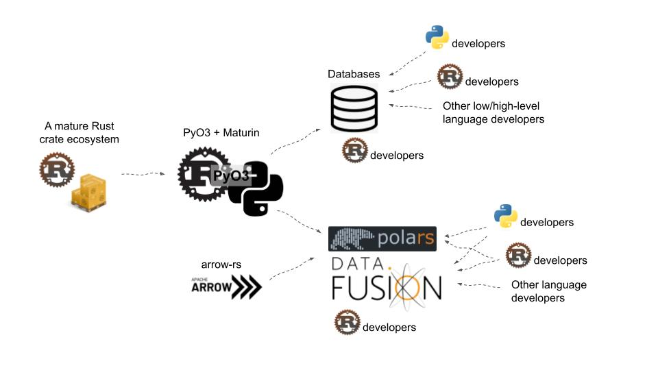

## Rust 🦀 is eating Python's data science tooling

Imagine you're on a boat sailing along the current on a river. Now, imagine that the lower decks of this boat _are being rebuilt and modified_ as it goes along! That's what it feels like to be a data engineer using Python today, because, as I'll describe in this post, there's a silent revolution happening under the hood, with Rust slowly but surely becoming the language of choice for low-level Python tooling.

Having had its stable 1.0 release in 2015, the initial few years for Rust were mostly about finding its niche among systems developers, which is the main purpose for which language was designed, and it quickly became [the most loved programming language](https://www.infoworld.com/article/3546337/rust-language-tops-stack-overflow-survey.html). I won't go too deep into why Rust is a great language, as there is a _lot_ of content online that covers this. Fast forward to today, and we can be sure that [Rust is here to stay](https://www.youtube.com/watch?v=A3AdN7U24iU), having built a robust, stable and thriving ecosystem of developers and tools.

## What makes for a widely adopted language?

For a programming language ecosystem to resonate with developers and flourish long term, merely having good language design isn't enough. It also takes the following:

- Adoption from a core "power user" community that builds foundational tooling
- Buy-in from a large community of additional developers that see the need for a new language
- An open, inclusive community
- Great learning material, available largely for free
- Useful real world applications that justify the need and use of the language

It's safe to say that, since 2015, the Rust community, and the language itself, has delivered on all counts. The following key features of Rust set it apart from a lot of other languages, making it resonate deeply with systems programmers in particular.

- Blazing fast 🔥 performance
- Memory safety
- Great support for concurrency

## A confluence of great tooling

What's most exciting, however, are the specific developments in Rust's tooling ecosystem that have come together in a very nice way in the period between 2018-2022, and whose combined potential hasn't been unleashed yet. Going back to our river analogy, the image below shows a number of streams joining a river that's flowing from left to right.

The following projects and their associated Rust crates (i.e., packages) play together really nicely:

* __Hyper + Actix web__: HTTP and web servers
* __PyO3 + Maturin__: Rust bindings for Python
* __Arrow__: In-memory columnar data format
* __DataFusion__: Query parsing and processing
* __Ballista__: Distributed query processing

It's okay if the terms above don't make complete sense yet -- the goal of this post is to explain how these tools will have a broader impact on the PyData ecosystem. Read on!

## The impact of PyO3

Because Python is a dynamically-typed interpreted language, it suffers in performance compared to statically typed, compiled languages. As a result, Python always relied on lower-level systems languages to perform the heavy lifting for expensive computations (things that involve loops or iteration). In the past, these languages used to be C, C++, Cython or even Fortran.

It's hard to overstate the importance of one particular Rust crate, [PyO3](https://github.com/PyO3/pyo3), which first came out in 2017. PyO3 allows Rust developers to _very easily_ produce Rust bindings that can be used in Python, allowing Python developers to access the full power of Rust. Although similar tools like pybind11 and SWIG exist for C++, portability and ease of sharing the binaries with end users was always a challenge, and this is where Rust + PyO3 really stands apart. The quality of Rust's crates.io package management system, combined with a thriving community that [documented the project](https://pyo3.rs/v0.19.0/) really well for developers from all languages, helped bring a large number of really smart people into the Rust ecosystem.

### How PyO3 allows you to use Rust from Python

PyO3 can be used to generate a native Python module, written in pure Rust. This is done on the Python side by using the [`maturin`](https://github.com/PyO3/maturin). As of June 2023, this package has been [downloaded more than 9 million times](https://pepy.tech/project/maturin?display=monthly) via the Python package index. `maturin` allows users who know (or are learning) Rust to easily export bindings and publish them as Python packages so the larger Python community can benefit from the performance of the underlying Rust code. To see how simple it is to set up, see [the PyO3 Rust crates page](https://crates.io/crates/pyo3) for details.

The following blog post's title is self-explanatory, and does a great job of highlighting how and why PyO3 + `maturin` bring a whole community of Rust and  Python developers together.

* [Making Python 100x faster with less than 100 lines of Rust](https://ohadravid.github.io/posts/2023-03-rusty-python/)

## The rise of Rust web servers 🔥

Because Rust is a systems language, it's as close to bare-metal as can be. And as a result, web servers and HTTP clients written in Rust are consistently among the fastest in existence. As of June 2023, 3 of the top 5 fastest web servers are written in Rust as per the [TechEmpower benchmarks](https://www.techempower.com/benchmarks/#section=data-r21&test=composite).

In general HTTP services like `may-minihttp` and `hyper`, and web servers like `xitca-web`, `actix`, `actix-web` and `axum` form the basis of a lot of downstream applications, like databases.

## Enabling database systems of the future

This brings us to the next key piece of technology enabled by the growing Rust ecosystem: databases. As web servers, HTTP clients and a host of other low level tools show performance gains all while enabling developer productivity, it becomes more and more feasible to build a team of developers that can embrace the challenge of building a complex database management system in Rust. In 2023, there are a number of really exciting databasesbeing built from the ground up in Rust, as can be seen in the [database implementations](https://lib.rs/database-implementations) page of the Rust library index.

Two databases stand out in particular, because they started off as being written in other languages.

### SurrealDB: From Golang to Rust

The creators of SurrealDB, a NewSQL database being written from the ground up in Rust, explain their reasoning in rewriting their entire code base (that was originally in Golang) in Rust: type safety, ease of reusing & distributing crates, and great support for generic types.



### LanceDB: From C++ to Rust

A recent serverless database, LanceDB, was originally written in C++, but one of the co-founders, Chang She, explains how, ["writing in Rust felt like such a breath of fresh air"](https://blog.lancedb.com/please-pardon-our-appearance-during-renovations-da8c8f49b383), that they decided to rewrite their entire code base in Rust.

* [Rewriting LanceDB in Rust](https://blog.lancedb.com/please-pardon-our-appearance-during-renovations-da8c8f49b383)

## Arrow and Polars

The Apache Arrow ecosystem originally began in 2015, when the creator of Pandas, Wes McKinney was interested in developing a fast, columnar, in-memory and most importantly, language-agnostic standard for representing data that could be queried efficiently. The parquet data format came out of the Arrow spec as a result. While Arrow was originally written in C++, in 2019, it was also ported over to Rust in order to allow Rust developers to build foundational tooling based on the Arrow spec while writing pure Rust code.

[Polars](https://github.com/pola-rs/polars) is a DataFrame library written in Rust, enabled by the underlying Arrow spec that was always designed to be language-agnostic. In multiple benchmarks, Polars has outperformed Pandas in tasks like data transformation and aggregation.

## DataFusion and Ballista

Because SQL is the primary means through which data is analyzed at scale, it follows that an efficient SQL parsing and execution in Rust was sorely needed. Between 2019-2022, this was achieved largely through the efforts of one person, [Andy Grove](https://andygrove.io/projects/). Largely through his efforts, it's clear that Rust, the Apache Arrow project, and the DataFusion Query Engine are increasingly being used to accelerate the creation of modern data stacks.

### What is DataFusion and why should you care?

In 2018, Andy Grove started off with the question, "What if Spark was written from the ground up in Rust"? In his [blog post](https://andygrove.io/2018/01/rust-is-for-big-data/), Grove mentions how Rust was uniquely suited to some of the large-scale distributed computing challenges that Spark set out to solve. The original Apache Spark project depended on the Java Virtual Machine (JVM), which suffered from numerous performance issues due to Java serialization, and Spark in general was notoriously hard to debug, with exceptionally long stack traces that would terrify most developers. The DataFusion project, with the foundation layer of the Arrow project, was able to address a lot of these issues, implementing a scalable, single-process, multi-threaded SQL query engine for parallel query execution. To learn more on why this matters, and the kinds of downstream applications this enables, watch the video below.



### Supercharging DataFusion with Ballista

Ballista is a distributed SQL query engine, designed to depend on DataFusion, also initially written by Andy Grove. [As mentioned on their GitHub](https://github.com/apache/arrow-ballista), it implements a similar design to Apache Spark, but is written fully in Rust, and, also unlike the original Spark that used the JVM, Ballista uses a columnar format (Arrow) as its foundation, allowing for much more efficient compression and parallelization. And most importantly, like DataFusion, language agnosticity is at the heart of the Ballista project, so numerous other programming language interfaces can be built on top of the base query engine, making future data scientists and engineers dance with joy 🕺💃.

By 2022, all of the projects (Arrow's Rust implementation, DataFusion and Ballista) were donated to the Apache Software Foundation, and the overarching goals of the foundation are to rebuild Spark from the ground up, with performance, safety, memory footprint & scalability in mind. If you're interested, the following video explains the Ballista architecture and vision in more detail.



## Pydantic

A blog post on Python and data engineering can't be complete without mentioning the data validation library, Pydantic. Because data cleansing and type validation are tasks that are run millions or billions of times during ETL jobs, running these using a performance-driven language like Rust can have huge consequences in terms of 

As of writing this post, v2 of Pydantic hasn't officially been released, but [as laid out in their plan](https://docs.pydantic.dev/latest/blog/pydantic-v2/#performance), rewriting the core logic of Pydantic in Rust is expected to make Pydantic v2 anywhere from 4x and 50x faster than v1 (which was purely in Python).

## Delta Lake

More recently, the Delta Lakes open source format has been popular for cases that need both offline and online data (i.e., when streaming is involved). The `delta-rs` Rust project provided the foundation for this framework, allowing the development of the [Python Delta Lake library](https://delta-io.github.io/delta-rs/python/). As described in the video linked below, "not everything needs a Spark cluster" 😀.

## Gathering our thoughts

Now that the background has been laid, we can visualize how the pieces of the underlying ecosystem fall in place as follows.

A mature ecosystem of crates (i.e., packages) in the Rust ecosystem coupled with a developer-friendly distribution framework like PyO3 and `maturin` allowed an explosion of foundational libraries that will power the next generation of software in the PyData ecosystem. The centralization around the developer tooling and specification, namely the Arrow project, allow for downstream base libraries like DataFusion (and soon Ballista) to offer distributed computing capabilities that will have a much lower memory footprint and consume far less resources (while much more efficiently using available resources), leading to a blazing fast 🔥 replacement to Spark in the PyData ecosystem.



## Conclusions

As described in this post, between 2018-2022, there have been multiple key developments in the Rust and PyData ecosystems that are changing the way Pythonistas work with data. And, it seems, the best of it is yet to come! Imagine a world where you have the option to seamlessly switch between the following:

* EDA and data transformation in Polars
* Data validation in Pydantic
* Depending on the size of your data, choose between one of DataFusion, DataFusion + Ballista, or Delta Lake to run run parallel queries on your data, either on a single machine or on a cluster
* Store the data and query it in a variety of Rust-powered databases:
  * Meilisearch (scalar search with typo-tolerance)
  * Qdrant (vector search using a client-server architecture)
  * LanceDB (vector search on multimodal data with a serverless architecture)

And, the best part is, all of this comes with you not having to leave the world of Python, while still benefitting from the blazing performance and innovations happening in the Rust ecosystem 😎.

As Will Jones says [in his post](https://www.datawill.io/posts/pandas-arrow-rust/):

> Let's have more Rust in Python's Arrow revolution.